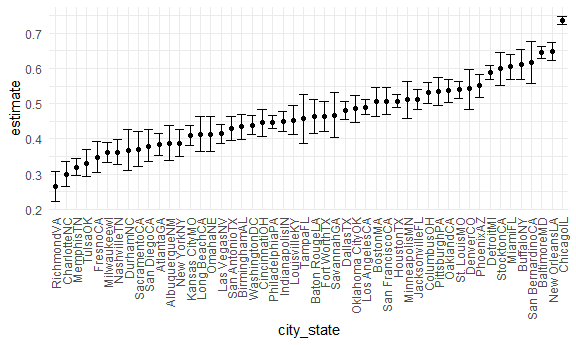

p8105\_hw5\_acm2268
================
Amanda Miles
11/19/2021

# Question 1

``` r
homicide_df = 
  read_csv("./data/homicide-data.csv", na = c("", "Unknown")) %>% 
  mutate(
    city_state = str_c(city, state),
    resolution = case_when(
      disposition == "Closed without arrest" ~ "unsolved",
      disposition == "Open/No arrest" ~ "unsolved",
      disposition == "Closed by arrest" ~ "solved"
    )
  ) %>% 
  relocate(city_state) %>%
  filter(city_state != "TulsaAL") %>%
  view()
```

    ## Rows: 52179 Columns: 12

    ## -- Column specification --------------------------------------------------------
    ## Delimiter: ","
    ## chr (8): uid, victim_last, victim_first, victim_race, victim_sex, city, stat...
    ## dbl (4): reported_date, victim_age, lat, lon

    ## 
    ## i Use `spec()` to retrieve the full column specification for this data.
    ## i Specify the column types or set `show_col_types = FALSE` to quiet this message.

## Baltimore, MD

``` r
baltimore_df = 
  homicide_df %>%
  filter(city_state == "BaltimoreMD") %>%
  view()

baltimore_summary = baltimore_df %>%
  summarize(
    unsolved = sum(resolution == "unsolved"),
    n = n()
  )

baltimore_test = prop.test(
  x = baltimore_summary %>% pull(unsolved), 
  n = baltimore_summary %>% pull(n)
)

baltimore_test %>%
  broom::tidy()
```

    ## # A tibble: 1 x 8
    ##   estimate statistic  p.value parameter conf.low conf.high method    alternative
    ##      <dbl>     <dbl>    <dbl>     <int>    <dbl>     <dbl> <chr>     <chr>      
    ## 1    0.646      239. 6.46e-54         1    0.628     0.663 1-sample~ two.sided

## Iteration test

First, write a function and test it.

``` r
prop_test_function = function(city_df) {
  
  city_summary = city_df %>%
  summarize(
    unsolved = sum(resolution == "unsolved"),
    n = n()
  )

city_test = prop.test(
  x = city_summary %>% pull(unsolved), 
  n = city_summary %>% pull(n)
)

return(city_test)
  
}

prop_test_function(baltimore_df)
```

    ## 
    ##  1-sample proportions test with continuity correction
    ## 
    ## data:  city_summary %>% pull(unsolved) out of city_summary %>% pull(n), null probability 0.5
    ## X-squared = 239.01, df = 1, p-value < 2.2e-16
    ## alternative hypothesis: true p is not equal to 0.5
    ## 95 percent confidence interval:
    ##  0.6275625 0.6631599
    ## sample estimates:
    ##         p 
    ## 0.6455607

## Iterate across cities

First, create a city-specific data frame using the nest function.

``` r
results_df = homicide_df %>%
  nest(data = uid:resolution) %>%
  mutate(
    test_results = map(data, prop_test_function),
    tidy_results = map(test_results, broom::tidy)
  ) %>%
  select(city_state, tidy_results) %>%
  unnest(tidy_results) %>%
  select(city_state, estimate, starts_with("conf")) %>%
  view()
```

## Plot with error bars showing estimates and CIs

``` r
results_df %>%
  mutate(
    city_state = fct_reorder(city_state, estimate)
  ) %>%
  ggplot(aes(x = city_state, y = estimate)) +
  geom_point() +
  geom_errorbar(aes(ymin = conf.low, ymax = conf.high)) +
  theme(axis.text.x = element_text(angle = 90, vjust = 0.5, hjust = 1))
```



# Question 2

## Creating a data frame with the files and participant data

``` r
file_vec = 
  list.files("./data/study_data",
             full.names = TRUE)

study_df =  
  tibble(
    file_name = file_vec
  ) %>%
  mutate(data = purrr::map(.x = file_name, ~read_csv(.x))) %>%
  unnest(data) %>% view()
```

    ## Rows: 1 Columns: 8

    ## -- Column specification --------------------------------------------------------
    ## Delimiter: ","
    ## dbl (8): week_1, week_2, week_3, week_4, week_5, week_6, week_7, week_8

    ## 
    ## i Use `spec()` to retrieve the full column specification for this data.
    ## i Specify the column types or set `show_col_types = FALSE` to quiet this message.

    ## Rows: 1 Columns: 8

    ## -- Column specification --------------------------------------------------------
    ## Delimiter: ","
    ## dbl (8): week_1, week_2, week_3, week_4, week_5, week_6, week_7, week_8

    ## 
    ## i Use `spec()` to retrieve the full column specification for this data.
    ## i Specify the column types or set `show_col_types = FALSE` to quiet this message.

    ## Rows: 1 Columns: 8

    ## -- Column specification --------------------------------------------------------
    ## Delimiter: ","
    ## dbl (8): week_1, week_2, week_3, week_4, week_5, week_6, week_7, week_8

    ## 
    ## i Use `spec()` to retrieve the full column specification for this data.
    ## i Specify the column types or set `show_col_types = FALSE` to quiet this message.

    ## Rows: 1 Columns: 8

    ## -- Column specification --------------------------------------------------------
    ## Delimiter: ","
    ## dbl (8): week_1, week_2, week_3, week_4, week_5, week_6, week_7, week_8

    ## 
    ## i Use `spec()` to retrieve the full column specification for this data.
    ## i Specify the column types or set `show_col_types = FALSE` to quiet this message.

    ## Rows: 1 Columns: 8

    ## -- Column specification --------------------------------------------------------
    ## Delimiter: ","
    ## dbl (8): week_1, week_2, week_3, week_4, week_5, week_6, week_7, week_8

    ## 
    ## i Use `spec()` to retrieve the full column specification for this data.
    ## i Specify the column types or set `show_col_types = FALSE` to quiet this message.

    ## Rows: 1 Columns: 8

    ## -- Column specification --------------------------------------------------------
    ## Delimiter: ","
    ## dbl (8): week_1, week_2, week_3, week_4, week_5, week_6, week_7, week_8

    ## 
    ## i Use `spec()` to retrieve the full column specification for this data.
    ## i Specify the column types or set `show_col_types = FALSE` to quiet this message.

    ## Rows: 1 Columns: 8

    ## -- Column specification --------------------------------------------------------
    ## Delimiter: ","
    ## dbl (8): week_1, week_2, week_3, week_4, week_5, week_6, week_7, week_8

    ## 
    ## i Use `spec()` to retrieve the full column specification for this data.
    ## i Specify the column types or set `show_col_types = FALSE` to quiet this message.

    ## Rows: 1 Columns: 8

    ## -- Column specification --------------------------------------------------------
    ## Delimiter: ","
    ## dbl (8): week_1, week_2, week_3, week_4, week_5, week_6, week_7, week_8

    ## 
    ## i Use `spec()` to retrieve the full column specification for this data.
    ## i Specify the column types or set `show_col_types = FALSE` to quiet this message.

    ## Rows: 1 Columns: 8

    ## -- Column specification --------------------------------------------------------
    ## Delimiter: ","
    ## dbl (8): week_1, week_2, week_3, week_4, week_5, week_6, week_7, week_8

    ## 
    ## i Use `spec()` to retrieve the full column specification for this data.
    ## i Specify the column types or set `show_col_types = FALSE` to quiet this message.

    ## Rows: 1 Columns: 8

    ## -- Column specification --------------------------------------------------------
    ## Delimiter: ","
    ## dbl (8): week_1, week_2, week_3, week_4, week_5, week_6, week_7, week_8

    ## 
    ## i Use `spec()` to retrieve the full column specification for this data.
    ## i Specify the column types or set `show_col_types = FALSE` to quiet this message.

    ## Rows: 1 Columns: 8

    ## -- Column specification --------------------------------------------------------
    ## Delimiter: ","
    ## dbl (8): week_1, week_2, week_3, week_4, week_5, week_6, week_7, week_8

    ## 
    ## i Use `spec()` to retrieve the full column specification for this data.
    ## i Specify the column types or set `show_col_types = FALSE` to quiet this message.

    ## Rows: 1 Columns: 8

    ## -- Column specification --------------------------------------------------------
    ## Delimiter: ","
    ## dbl (8): week_1, week_2, week_3, week_4, week_5, week_6, week_7, week_8

    ## 
    ## i Use `spec()` to retrieve the full column specification for this data.
    ## i Specify the column types or set `show_col_types = FALSE` to quiet this message.

    ## Rows: 1 Columns: 8

    ## -- Column specification --------------------------------------------------------
    ## Delimiter: ","
    ## dbl (8): week_1, week_2, week_3, week_4, week_5, week_6, week_7, week_8

    ## 
    ## i Use `spec()` to retrieve the full column specification for this data.
    ## i Specify the column types or set `show_col_types = FALSE` to quiet this message.

    ## Rows: 1 Columns: 8

    ## -- Column specification --------------------------------------------------------
    ## Delimiter: ","
    ## dbl (8): week_1, week_2, week_3, week_4, week_5, week_6, week_7, week_8

    ## 
    ## i Use `spec()` to retrieve the full column specification for this data.
    ## i Specify the column types or set `show_col_types = FALSE` to quiet this message.

    ## Rows: 1 Columns: 8

    ## -- Column specification --------------------------------------------------------
    ## Delimiter: ","
    ## dbl (8): week_1, week_2, week_3, week_4, week_5, week_6, week_7, week_8

    ## 
    ## i Use `spec()` to retrieve the full column specification for this data.
    ## i Specify the column types or set `show_col_types = FALSE` to quiet this message.

    ## Rows: 1 Columns: 8

    ## -- Column specification --------------------------------------------------------
    ## Delimiter: ","
    ## dbl (8): week_1, week_2, week_3, week_4, week_5, week_6, week_7, week_8

    ## 
    ## i Use `spec()` to retrieve the full column specification for this data.
    ## i Specify the column types or set `show_col_types = FALSE` to quiet this message.

    ## Rows: 1 Columns: 8

    ## -- Column specification --------------------------------------------------------
    ## Delimiter: ","
    ## dbl (8): week_1, week_2, week_3, week_4, week_5, week_6, week_7, week_8

    ## 
    ## i Use `spec()` to retrieve the full column specification for this data.
    ## i Specify the column types or set `show_col_types = FALSE` to quiet this message.

    ## Rows: 1 Columns: 8

    ## -- Column specification --------------------------------------------------------
    ## Delimiter: ","
    ## dbl (8): week_1, week_2, week_3, week_4, week_5, week_6, week_7, week_8

    ## 
    ## i Use `spec()` to retrieve the full column specification for this data.
    ## i Specify the column types or set `show_col_types = FALSE` to quiet this message.

    ## Rows: 1 Columns: 8

    ## -- Column specification --------------------------------------------------------
    ## Delimiter: ","
    ## dbl (8): week_1, week_2, week_3, week_4, week_5, week_6, week_7, week_8

    ## 
    ## i Use `spec()` to retrieve the full column specification for this data.
    ## i Specify the column types or set `show_col_types = FALSE` to quiet this message.

    ## Rows: 1 Columns: 8

    ## -- Column specification --------------------------------------------------------
    ## Delimiter: ","
    ## dbl (8): week_1, week_2, week_3, week_4, week_5, week_6, week_7, week_8

    ## 
    ## i Use `spec()` to retrieve the full column specification for this data.
    ## i Specify the column types or set `show_col_types = FALSE` to quiet this message.

## Tidying the data

``` r
study_tidy_df = study_df %>%
  separate(
    file_name,
    into = c("period", "path_1", "path_2", "arm_id"),
    sep = "/") %>%
  mutate(
    arm_id = str_replace(arm_id, "\\.csv", "")
  ) %>%
  select(-c(period, path_1, path_2)) %>%
  view()
```

## Additional tidying and spaghetti plot of participants over time

``` r
study_plot_df = study_tidy_df %>%
  mutate(
   arm_id_2 = arm_id
  ) %>%
  separate(
    arm_id_2,
    into = c("arm", "participant_id"),
    sep = "_") %>%
  mutate(
    arm = case_when(
      arm == "con" ~ "control",
      arm == "exp" ~ "experimental"
    )
  ) %>%
  relocate(arm_id, arm, participant_id) %>%
  pivot_longer(
    week_1:week_8,
    names_to = "week",
    values_to = "observations"
  ) %>%
  mutate(
    week = str_replace(week, "week_", ""),
    week = as.numeric(week)
  )

ggplot(study_plot_df, aes(x = week, y = observations, color = arm)) +
  geom_line() + 
  theme(legend.position = "right") +
  labs(x = "Week", y = "Subject Observations", title = "Subject Observations over Time by Arm")
```


