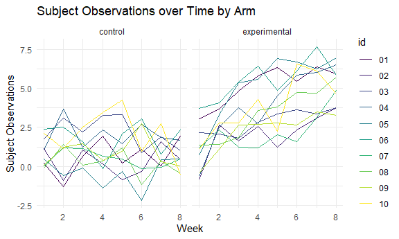

p8105\_hw5\_acm2268
================
Amanda Miles
11/19/2021

# Question 1

``` r
homicide_df = 
  read_csv("./data/homicide-data.csv", na = c("", "Unknown")) %>% 
  mutate(
    city_state = str_c(city, state),
    resolution = case_when(
      disposition == "Closed without arrest" ~ "unsolved",
      disposition == "Open/No arrest" ~ "unsolved",
      disposition == "Closed by arrest" ~ "solved"
    )
  ) %>% 
  relocate(city_state) %>%
  filter(city_state != "TulsaAL") %>%
  view()
```

    ## Rows: 52179 Columns: 12

    ## -- Column specification --------------------------------------------------------
    ## Delimiter: ","
    ## chr (8): uid, victim_last, victim_first, victim_race, victim_sex, city, stat...
    ## dbl (4): reported_date, victim_age, lat, lon

    ## 
    ## i Use `spec()` to retrieve the full column specification for this data.
    ## i Specify the column types or set `show_col_types = FALSE` to quiet this message.

``` r
skimr::skim(homicide_df)
```

|                                                  |              |
|:-------------------------------------------------|:-------------|
| Name                                             | homicide\_df |
| Number of rows                                   | 52178        |
| Number of columns                                | 14           |
| \_\_\_\_\_\_\_\_\_\_\_\_\_\_\_\_\_\_\_\_\_\_\_   |              |
| Column type frequency:                           |              |
| character                                        | 10           |
| numeric                                          | 4            |
| \_\_\_\_\_\_\_\_\_\_\_\_\_\_\_\_\_\_\_\_\_\_\_\_ |              |
| Group variables                                  | None         |

Data summary

**Variable type: character**

| skim\_variable | n\_missing | complete\_rate | min | max | empty | n\_unique | whitespace |
|:---------------|-----------:|---------------:|----:|----:|------:|----------:|-----------:|
| city\_state    |          0 |           1.00 |   7 |  16 |     0 |        50 |          0 |
| uid            |          0 |           1.00 |   9 |  10 |     0 |     52178 |          0 |
| victim\_last   |       5764 |           0.89 |   1 |  20 |     0 |     12686 |          0 |
| victim\_first  |       5762 |           0.89 |   1 |  28 |     0 |     16639 |          0 |
| victim\_race   |       4199 |           0.92 |   5 |   8 |     0 |         5 |          0 |
| victim\_sex    |       4231 |           0.92 |   4 |   6 |     0 |         2 |          0 |
| city           |          0 |           1.00 |   5 |  14 |     0 |        50 |          0 |
| state          |          0 |           1.00 |   2 |   2 |     0 |        28 |          0 |
| disposition    |          0 |           1.00 |  14 |  21 |     0 |         3 |          0 |
| resolution     |          0 |           1.00 |   6 |   8 |     0 |         2 |          0 |

**Variable type: numeric**

| skim\_variable | n\_missing | complete\_rate |        mean |         sd |          p0 |         p25 |         p50 |         p75 |          p100 | hist  |
|:---------------|-----------:|---------------:|------------:|-----------:|------------:|------------:|------------:|------------:|--------------:|:------|
| reported\_date |          0 |           1.00 | 20130898.59 | 1123430.39 | 20070101.00 | 20100318.00 | 20121216.00 | 20150911.00 | 201511105\.00 | ▇▁▁▁▁ |
| victim\_age    |       2999 |           0.94 |       31.80 |      14.42 |        0.00 |       22.00 |       28.00 |       40.00 |        102.00 | ▃▇▃▁▁ |
| lat            |         60 |           1.00 |       37.03 |       4.35 |       25.73 |       33.77 |       38.53 |       40.03 |         45.05 | ▁▅▅▇▅ |
| lon            |         60 |           1.00 |      -91.47 |      13.75 |     -122.51 |      -96.00 |      -87.71 |      -81.76 |        -71.01 | ▃▁▃▇▅ |

## Baltimore, MD

``` r
baltimore_df = 
  homicide_df %>%
  filter(city_state == "BaltimoreMD") %>%
  view()

baltimore_summary = baltimore_df %>%
  summarize(
    unsolved = sum(resolution == "unsolved"),
    n = n()
  )

baltimore_test = prop.test(
  x = baltimore_summary %>% pull(unsolved), 
  n = baltimore_summary %>% pull(n)
)

baltimore_test %>%
  broom::tidy()
```

    ## # A tibble: 1 x 8
    ##   estimate statistic  p.value parameter conf.low conf.high method    alternative
    ##      <dbl>     <dbl>    <dbl>     <int>    <dbl>     <dbl> <chr>     <chr>      
    ## 1    0.646      239. 6.46e-54         1    0.628     0.663 1-sample~ two.sided

## Iteration test

First, write a function and test it.

``` r
prop_test_function = function(city_df) {
  
  city_summary = city_df %>%
  summarize(
    unsolved = sum(resolution == "unsolved"),
    n = n()
  )

city_test = prop.test(
  x = city_summary %>% pull(unsolved), 
  n = city_summary %>% pull(n)
)

return(city_test)
  
}

prop_test_function(baltimore_df)
```

    ## 
    ##  1-sample proportions test with continuity correction
    ## 
    ## data:  city_summary %>% pull(unsolved) out of city_summary %>% pull(n), null probability 0.5
    ## X-squared = 239.01, df = 1, p-value < 2.2e-16
    ## alternative hypothesis: true p is not equal to 0.5
    ## 95 percent confidence interval:
    ##  0.6275625 0.6631599
    ## sample estimates:
    ##         p 
    ## 0.6455607

## Iterate across cities

First, create a city-specific data frame using the nest function.

``` r
results_df = homicide_df %>%
  nest(data = uid:resolution) %>%
  mutate(
    test_results = map(data, prop_test_function),
    tidy_results = map(test_results, broom::tidy)
  ) %>%
  select(city_state, tidy_results) %>%
  unnest(tidy_results) %>%
  select(city_state, estimate, starts_with("conf")) %>%
  view()
```

## Plot with error bars showing estimates and CIs

``` r
results_df %>%
  mutate(
    city_state = fct_reorder(city_state, estimate)
  ) %>%
  ggplot(aes(x = city_state, y = estimate)) +
  geom_point() +
  geom_errorbar(aes(ymin = conf.low, ymax = conf.high)) +
  theme(axis.text.x = element_text(angle = 90, vjust = 0.5, hjust = 1))
```


# Question 2

## Creating a data frame with the files

``` r
file_vec = 
  list.files("./data/study_data",
             full.names = TRUE)

study_df =  
  tibble(
    file_name = file_vec
  ) %>%
  mutate(data = purrr::map(.x = file_name, ~read_csv(.x))) %>%
  unnest(data)
```

    ## Rows: 1 Columns: 8

    ## -- Column specification --------------------------------------------------------
    ## Delimiter: ","
    ## dbl (8): week_1, week_2, week_3, week_4, week_5, week_6, week_7, week_8

    ## 
    ## i Use `spec()` to retrieve the full column specification for this data.
    ## i Specify the column types or set `show_col_types = FALSE` to quiet this message.

    ## Rows: 1 Columns: 8

    ## -- Column specification --------------------------------------------------------
    ## Delimiter: ","
    ## dbl (8): week_1, week_2, week_3, week_4, week_5, week_6, week_7, week_8

    ## 
    ## i Use `spec()` to retrieve the full column specification for this data.
    ## i Specify the column types or set `show_col_types = FALSE` to quiet this message.

    ## Rows: 1 Columns: 8

    ## -- Column specification --------------------------------------------------------
    ## Delimiter: ","
    ## dbl (8): week_1, week_2, week_3, week_4, week_5, week_6, week_7, week_8

    ## 
    ## i Use `spec()` to retrieve the full column specification for this data.
    ## i Specify the column types or set `show_col_types = FALSE` to quiet this message.

    ## Rows: 1 Columns: 8

    ## -- Column specification --------------------------------------------------------
    ## Delimiter: ","
    ## dbl (8): week_1, week_2, week_3, week_4, week_5, week_6, week_7, week_8

    ## 
    ## i Use `spec()` to retrieve the full column specification for this data.
    ## i Specify the column types or set `show_col_types = FALSE` to quiet this message.

    ## Rows: 1 Columns: 8

    ## -- Column specification --------------------------------------------------------
    ## Delimiter: ","
    ## dbl (8): week_1, week_2, week_3, week_4, week_5, week_6, week_7, week_8

    ## 
    ## i Use `spec()` to retrieve the full column specification for this data.
    ## i Specify the column types or set `show_col_types = FALSE` to quiet this message.

    ## Rows: 1 Columns: 8

    ## -- Column specification --------------------------------------------------------
    ## Delimiter: ","
    ## dbl (8): week_1, week_2, week_3, week_4, week_5, week_6, week_7, week_8

    ## 
    ## i Use `spec()` to retrieve the full column specification for this data.
    ## i Specify the column types or set `show_col_types = FALSE` to quiet this message.

    ## Rows: 1 Columns: 8

    ## -- Column specification --------------------------------------------------------
    ## Delimiter: ","
    ## dbl (8): week_1, week_2, week_3, week_4, week_5, week_6, week_7, week_8

    ## 
    ## i Use `spec()` to retrieve the full column specification for this data.
    ## i Specify the column types or set `show_col_types = FALSE` to quiet this message.

    ## Rows: 1 Columns: 8

    ## -- Column specification --------------------------------------------------------
    ## Delimiter: ","
    ## dbl (8): week_1, week_2, week_3, week_4, week_5, week_6, week_7, week_8

    ## 
    ## i Use `spec()` to retrieve the full column specification for this data.
    ## i Specify the column types or set `show_col_types = FALSE` to quiet this message.

    ## Rows: 1 Columns: 8

    ## -- Column specification --------------------------------------------------------
    ## Delimiter: ","
    ## dbl (8): week_1, week_2, week_3, week_4, week_5, week_6, week_7, week_8

    ## 
    ## i Use `spec()` to retrieve the full column specification for this data.
    ## i Specify the column types or set `show_col_types = FALSE` to quiet this message.

    ## Rows: 1 Columns: 8

    ## -- Column specification --------------------------------------------------------
    ## Delimiter: ","
    ## dbl (8): week_1, week_2, week_3, week_4, week_5, week_6, week_7, week_8

    ## 
    ## i Use `spec()` to retrieve the full column specification for this data.
    ## i Specify the column types or set `show_col_types = FALSE` to quiet this message.

    ## Rows: 1 Columns: 8

    ## -- Column specification --------------------------------------------------------
    ## Delimiter: ","
    ## dbl (8): week_1, week_2, week_3, week_4, week_5, week_6, week_7, week_8

    ## 
    ## i Use `spec()` to retrieve the full column specification for this data.
    ## i Specify the column types or set `show_col_types = FALSE` to quiet this message.

    ## Rows: 1 Columns: 8

    ## -- Column specification --------------------------------------------------------
    ## Delimiter: ","
    ## dbl (8): week_1, week_2, week_3, week_4, week_5, week_6, week_7, week_8

    ## 
    ## i Use `spec()` to retrieve the full column specification for this data.
    ## i Specify the column types or set `show_col_types = FALSE` to quiet this message.

    ## Rows: 1 Columns: 8

    ## -- Column specification --------------------------------------------------------
    ## Delimiter: ","
    ## dbl (8): week_1, week_2, week_3, week_4, week_5, week_6, week_7, week_8

    ## 
    ## i Use `spec()` to retrieve the full column specification for this data.
    ## i Specify the column types or set `show_col_types = FALSE` to quiet this message.

    ## Rows: 1 Columns: 8

    ## -- Column specification --------------------------------------------------------
    ## Delimiter: ","
    ## dbl (8): week_1, week_2, week_3, week_4, week_5, week_6, week_7, week_8

    ## 
    ## i Use `spec()` to retrieve the full column specification for this data.
    ## i Specify the column types or set `show_col_types = FALSE` to quiet this message.

    ## Rows: 1 Columns: 8

    ## -- Column specification --------------------------------------------------------
    ## Delimiter: ","
    ## dbl (8): week_1, week_2, week_3, week_4, week_5, week_6, week_7, week_8

    ## 
    ## i Use `spec()` to retrieve the full column specification for this data.
    ## i Specify the column types or set `show_col_types = FALSE` to quiet this message.

    ## Rows: 1 Columns: 8

    ## -- Column specification --------------------------------------------------------
    ## Delimiter: ","
    ## dbl (8): week_1, week_2, week_3, week_4, week_5, week_6, week_7, week_8

    ## 
    ## i Use `spec()` to retrieve the full column specification for this data.
    ## i Specify the column types or set `show_col_types = FALSE` to quiet this message.

    ## Rows: 1 Columns: 8

    ## -- Column specification --------------------------------------------------------
    ## Delimiter: ","
    ## dbl (8): week_1, week_2, week_3, week_4, week_5, week_6, week_7, week_8

    ## 
    ## i Use `spec()` to retrieve the full column specification for this data.
    ## i Specify the column types or set `show_col_types = FALSE` to quiet this message.

    ## Rows: 1 Columns: 8

    ## -- Column specification --------------------------------------------------------
    ## Delimiter: ","
    ## dbl (8): week_1, week_2, week_3, week_4, week_5, week_6, week_7, week_8

    ## 
    ## i Use `spec()` to retrieve the full column specification for this data.
    ## i Specify the column types or set `show_col_types = FALSE` to quiet this message.

    ## Rows: 1 Columns: 8

    ## -- Column specification --------------------------------------------------------
    ## Delimiter: ","
    ## dbl (8): week_1, week_2, week_3, week_4, week_5, week_6, week_7, week_8

    ## 
    ## i Use `spec()` to retrieve the full column specification for this data.
    ## i Specify the column types or set `show_col_types = FALSE` to quiet this message.

    ## Rows: 1 Columns: 8

    ## -- Column specification --------------------------------------------------------
    ## Delimiter: ","
    ## dbl (8): week_1, week_2, week_3, week_4, week_5, week_6, week_7, week_8

    ## 
    ## i Use `spec()` to retrieve the full column specification for this data.
    ## i Specify the column types or set `show_col_types = FALSE` to quiet this message.

## Tidying the data

``` r
study_tidy_df = study_df %>%
  separate(
    file_name,
    into = c("period", "path_1", "path_2", "arm_id"),
    sep = "/") %>%
  mutate(
    arm_id = str_replace(arm_id, "\\.csv", "")
  ) %>%
  select(-c(period, path_1, path_2)) %>%
  view()
```

## Additional tidying and spaghetti plot of participants over time

``` r
study_plot_df = study_tidy_df %>%
  mutate(
   arm_id_2 = arm_id
  ) %>%
  separate(
    arm_id_2,
    into = c("arm", "id"),
    sep = "_") %>%
  mutate(
    arm = case_when(
      arm == "con" ~ "control",
      arm == "exp" ~ "experimental"
    )
  ) %>%
  relocate(arm_id, arm, id) %>%
  pivot_longer(
    week_1:week_8,
    names_to = "week",
    values_to = "observations"
  ) %>%
  mutate(
    week = str_replace(week, "week_", ""),
    week = as.numeric(week)
  )

ggplot(study_plot_df, aes(x = week, y = observations, color = id)) +
  geom_line() + 
  facet_grid(. ~ arm) +
  theme(legend.position = "right") +
  labs(x = "Week", y = "Subject Observations", title = "Subject Observations over Time by Arm")
```



# Question 3

## Loading in iris data

``` r
library(tidyverse)

set.seed(10)

iris_with_missing = iris %>% 
  map_df(~replace(.x, sample(1:150, 20), NA)) %>%
  mutate(Species = as.character(Species)) %>%
  janitor::clean_names()
```

## Writing the function

``` r
replace_missing = function(x) {
  
  if (is.numeric(x)) {
    replace(x, is.na(x), mean(x, na.rm = TRUE))
  }
  
  if (is.character(x)) {
    replace(x, is.na(x), "virginica")
  }
}
   
replace_missing(iris_with_missing$species)
```

    ##   [1] "setosa"     "setosa"     "setosa"     "setosa"     "setosa"    
    ##   [6] "setosa"     "setosa"     "setosa"     "setosa"     "setosa"    
    ##  [11] "setosa"     "setosa"     "setosa"     "setosa"     "setosa"    
    ##  [16] "setosa"     "setosa"     "setosa"     "setosa"     "setosa"    
    ##  [21] "setosa"     "virginica"  "setosa"     "setosa"     "virginica" 
    ##  [26] "setosa"     "virginica"  "setosa"     "setosa"     "setosa"    
    ##  [31] "setosa"     "setosa"     "setosa"     "setosa"     "setosa"    
    ##  [36] "setosa"     "setosa"     "setosa"     "setosa"     "setosa"    
    ##  [41] "setosa"     "virginica"  "setosa"     "setosa"     "setosa"    
    ##  [46] "virginica"  "setosa"     "setosa"     "setosa"     "setosa"    
    ##  [51] "virginica"  "versicolor" "versicolor" "versicolor" "versicolor"
    ##  [56] "versicolor" "virginica"  "versicolor" "virginica"  "versicolor"
    ##  [61] "versicolor" "versicolor" "versicolor" "versicolor" "versicolor"
    ##  [66] "versicolor" "versicolor" "versicolor" "versicolor" "versicolor"
    ##  [71] "versicolor" "virginica"  "versicolor" "versicolor" "versicolor"
    ##  [76] "versicolor" "versicolor" "versicolor" "versicolor" "virginica" 
    ##  [81] "versicolor" "versicolor" "versicolor" "versicolor" "versicolor"
    ##  [86] "versicolor" "versicolor" "versicolor" "versicolor" "versicolor"
    ##  [91] "versicolor" "versicolor" "versicolor" "virginica"  "versicolor"
    ##  [96] "versicolor" "versicolor" "versicolor" "versicolor" "virginica" 
    ## [101] "virginica"  "virginica"  "virginica"  "virginica"  "virginica" 
    ## [106] "virginica"  "virginica"  "virginica"  "virginica"  "virginica" 
    ## [111] "virginica"  "virginica"  "virginica"  "virginica"  "virginica" 
    ## [116] "virginica"  "virginica"  "virginica"  "virginica"  "virginica" 
    ## [121] "virginica"  "virginica"  "virginica"  "virginica"  "virginica" 
    ## [126] "virginica"  "virginica"  "virginica"  "virginica"  "virginica" 
    ## [131] "virginica"  "virginica"  "virginica"  "virginica"  "virginica" 
    ## [136] "virginica"  "virginica"  "virginica"  "virginica"  "virginica" 
    ## [141] "virginica"  "virginica"  "virginica"  "virginica"  "virginica" 
    ## [146] "virginica"  "virginica"  "virginica"  "virginica"  "virginica"

``` r
iris_nested = nest(iris_with_missing, data = sepal_length:species)

iris_nested %>%
  mutate(
    data = map(data, replace_missing)
  ) %>%
  unnest(data)
```

    ## # A tibble: 0 x 1
    ## # ... with 1 variable: data <???>

``` r
view(iris_nested)
```
